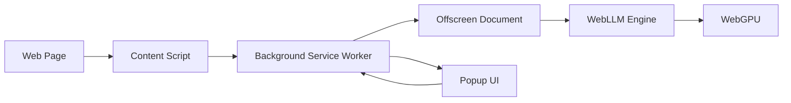

# 🤖 WebLLM Document Chat Chrome Extension

A privacy-focused Chrome extension that enables **local, offline AI conversations** with web documents using WebLLM and WebGPU acceleration.


---

## ✨ **Features**

- 🔒 **100% Private** - All processing happens locally in your browser
- 🌐 **Offline Capable** - No internet required after initial model download
- ⚡ **WebGPU Accelerated** - Hardware acceleration for fast inference
- 📄 **Automatic Text Extraction** - Extracts content from web pages automatically
- 💬 **AI-Powered Chat** - Ask questions about any document or webpage
- 🎯 **No Cloud Dependencies** - Your data never leaves your device

---

## 🎥 **Demo**

> Chat with any webpage or document directly in your browser using local AI!

---

## 📋 **Table of Contents**

- [System Requirements](#system-requirements)
- [Installation](#installation)
- [Usage](#usage)
- [Performance](#performance)
- [Project Structure](#project-structure)
- [Development](#development)
- [Troubleshooting](#troubleshooting)
- [Roadmap](#roadmap)
- [Contributing](#contributing)
- [License](#license)

---

## 💻 **System Requirements**

### **Minimum Requirements:**
- **Browser**: Chrome/Edge 113+ (with WebGPU support)
- **RAM**: 8GB (6GB+ free recommended)
- **GPU**: Any GPU with WebGPU support (integrated or dedicated)
- **Storage**: 2-4GB for model download

### **Recommended for Best Performance:**
- **RAM**: 16GB+
- **GPU**: Dedicated GPU (NVIDIA GTX 1650+, AMD RX 5500+)
- **Storage**: SSD for faster model loading

### **Performance Expectations:**

| Hardware Tier | Response Time | Tokens/Second |
|---------------|---------------|---------------|
| Minimum (Intel UHD, 8GB) | 1-3 minutes | 3-5 |
| Recommended (GTX 1650, 16GB) | 10-30 seconds | 10-15 |
| High-End (RTX 3060+, 32GB) | 5-15 seconds | 20-40 |
| Enthusiast (RTX 4090) | 2-5 seconds | 50-100+ |

---

## 🚀 **Installation**

### **Prerequisites**

1. **Enable WebGPU in Chrome:**
   - Go to `chrome://flags`
   - Search for "Unsafe WebGPU"
   - Enable **#enable-unsafe-webgpu**
   - Restart Chrome

2. **Verify WebGPU is Working:**
   - Visit `chrome://gpu`
   - Check that "WebGPU" shows "Hardware accelerated"

### **Install Extension**

#### **Method 1: From Release (Recommended)**
1. Download the latest release from [Releases](../../releases)
2. Extract the ZIP file
3. Open Chrome and go to `chrome://extensions`
4. Enable "Developer mode" (top right)
5. Click "Load unpacked"
6. Select the extracted `dist` folder

#### **Method 2: Build from Source**

```bash
# Clone the repository
git clone https://github.com/YOUR_USERNAME/webllm-doc-chat.git
cd webllm-doc-chat

# Install dependencies
npm install

# Build the extension
npm run build

# Load the extension
# 1. Go to chrome://extensions
# 2. Enable "Developer mode"
# 3. Click "Load unpacked"
# 4. Select the 'dist' folder
```

---

## 📖 **Usage**

### **First Time Setup**

1. **Install the extension** (see above)
2. **Navigate to any webpage**
3. **Click the extension icon** in Chrome toolbar
4. **Wait for model download** (1.7GB, takes 3-5 minutes on first use)
   - Progress will be shown in the popup
   - Model is cached for future use (30-60 sec load time after first use)

### **Chatting with Documents**

1. **Open any webpage** with text content
2. **Click the extension icon**
3. **Wait for "Model ready!"** status
4. **Type your question** in the input field
5. **Press Send** or hit Enter
6. **Wait for AI response** (10 seconds to 3 minutes depending on hardware)

### **Tips for Best Experience**

- ✅ **Keep questions concise** - Shorter queries = faster responses
- ✅ **Close other tabs** - Frees up RAM for better performance
- ✅ **Wait for responses** - Don't send multiple messages while waiting
- ✅ **Use simple language** - The model understands plain English best

---

## ⚡ **Performance**

### **First-Time Model Download**
- **Size**: ~1.7GB (Llama-3.2-3B quantized model)
- **Time**: 3-5 minutes (depending on internet speed)
- **Storage**: Cached in browser for future use

### **Subsequent Loads**
- **Time**: 10-60 seconds (loads from cache)
- **No internet required**

### **Response Generation**
- **Depends on**: GPU performance, available RAM, query complexity
- **Typical**: 10 seconds to 2 minutes
- **Streaming**: Not yet implemented (responses appear all at once)

---

## 📁 **Project Structure**

```
webllm-doc-chat/
├── src/
│   ├── background/          # Service worker
│   │   └── background.ts    # Background script (message routing)
│   ├── content/             # Content scripts
│   │   └── content.ts       # Page text extraction
│   ├── popup/               # Extension popup UI
│   │   ├── popup.html       # Popup interface
│   │   └── popup.ts         # Popup logic
│   ├── offscreen/           # Offscreen document
│   │   ├── offscreen.html   # Offscreen page
│   │   └── offscreen.ts     # WebLLM integration
│   ├── shared/              # Shared utilities
│   │   └── types.ts         # TypeScript types
│   ├── assets/              # Icons and images
│   └── manifest.json        # Extension manifest
├── dist/                    # Built extension (generated)
├── docs/                    # Documentation
├── tests/                   # Test files (future)
├── webpack.config.js        # Webpack configuration
├── tsconfig.json            # TypeScript configuration
├── package.json             # NPM dependencies
└── README.md                # This file
```

---

## 🛠 **Development**

### **Setup Development Environment**

```bash
# Install dependencies
npm install

# Start development build (watches for changes)
npm run dev

# Build for production
npm run build

# Type checking
npm run type-check

# Linting
npm run lint

# Clean build artifacts
npm run clean
```

### **Testing the Extension**

1. **Make changes** to source files
2. **Build automatically updates** (if using `npm run dev`)
3. **Reload extension** in Chrome:
   - Go to `chrome://extensions`
   - Click reload icon on the extension
4. **Test your changes**

### **Architecture Overview**



**Message Flow:**
1. **Content Script** extracts page text → sends to Background
2. **Background** stores context, routes messages
3. **Popup** sends user query → Background → Offscreen
4. **Offscreen** processes with WebLLM → sends response back
5. **Popup** displays AI response to user

---

## 🐛 **Troubleshooting**

### **WebGPU Not Available**

**Problem**: `Unable to find a compatible GPU`

**Solutions**:
1. Enable `chrome://flags/#enable-unsafe-webgpu`
2. Check `chrome://gpu` - WebGPU should be "Available"
3. Update Chrome to latest version
4. Update GPU drivers
5. **If on Windows**: Remove `--disable-gpu` from Chrome shortcuts

### **Model Not Loading**

**Problem**: Stuck at "Loading model..."

**Solutions**:
1. Check internet connection (first download only)
2. Clear browser cache and reload extension
3. Close other tabs to free RAM
4. Check available disk space (need 2-4GB)

### **Slow Responses**

**Problem**: Responses take 3+ minutes

**Solutions**:
1. Close other Chrome tabs/apps
2. Check RAM usage (should have 2GB+ free)
3. Use shorter, simpler queries
4. Consider hardware upgrade (more RAM, better GPU)

### **No Response at All**

**Problem**: Message sent but no response after 5+ minutes

**Solutions**:
1. Check console logs (offscreen.html inspect)
2. Reload extension completely
3. Restart Chrome
4. Check if out of memory (Task Manager)

---

## 🗺 **Roadmap**

### **Phase 1: Foundation** ✅ COMPLETE
- ✅ Extension skeleton with MV3
- ✅ WebLLM integration
- ✅ WebGPU setup
- ✅ Content script text extraction
- ✅ Basic chat functionality

### **Phase 2: Document Processing** 🚧 IN PROGRESS
- [ ] PDF.js integration for PDF files
- [ ] File System Access API for local files
- [ ] Text chunking for large documents
- [ ] Basic RAG implementation

### **Phase 3: Enhanced UX** 📋 PLANNED
- [ ] Response streaming (show text as it generates)
- [ ] Model management UI (switch models)
- [ ] Chat history persistence (IndexedDB)
- [ ] Loading indicators and progress bars
- [ ] Error handling improvements

### **Phase 4: Advanced Features** 💡 FUTURE
- [ ] Multiple model support (1B, 3B, 7B)
- [ ] Context window optimization
- [ ] Export/import chat history
- [ ] Custom prompts and templates
- [ ] Performance analytics

### **Phase 5: Production** 🎯 GOAL
- [ ] Chrome Web Store submission
- [ ] User documentation and tutorials
- [ ] Performance benchmarks
- [ ] Community feedback integration

---

## 🤝 **Contributing**

Contributions are welcome! Here's how you can help:

1. **Fork the repository**
2. **Create a feature branch**: `git checkout -b feature/amazing-feature`
3. **Make your changes**
4. **Test thoroughly**
5. **Commit**: `git commit -m 'Add amazing feature'`
6. **Push**: `git push origin feature/amazing-feature`
7. **Open a Pull Request**

### **Development Guidelines**
- Follow existing code style
- Add TypeScript types for new code
- Test on multiple hardware configurations
- Update documentation for new features

---

## 📄 **License**

This project is licensed under the MIT License - see the [LICENSE](LICENSE) file for details.

---

## 🙏 **Acknowledgments**

- **[WebLLM](https://github.com/mlc-ai/web-llm)** - For making local LLM inference in browsers possible
- **[MLC-AI](https://mlc.ai/)** - For the quantized models and runtime
- **Chrome Extensions Team** - For Manifest V3 and WebGPU support
- **Community Contributors** - Thank you for testing and feedback!

---

## 📞 **Support**

- **Issues**: [GitHub Issues](../../issues)
- **Discussions**: [GitHub Discussions](../../discussions)
- **Email**: your.email@example.com

---

## 🌟 **Star History**

If you find this project useful, please consider giving it a star! ⭐

---

## 📊 **Project Stats**


---

**Made with ❤️ for privacy-conscious users**
