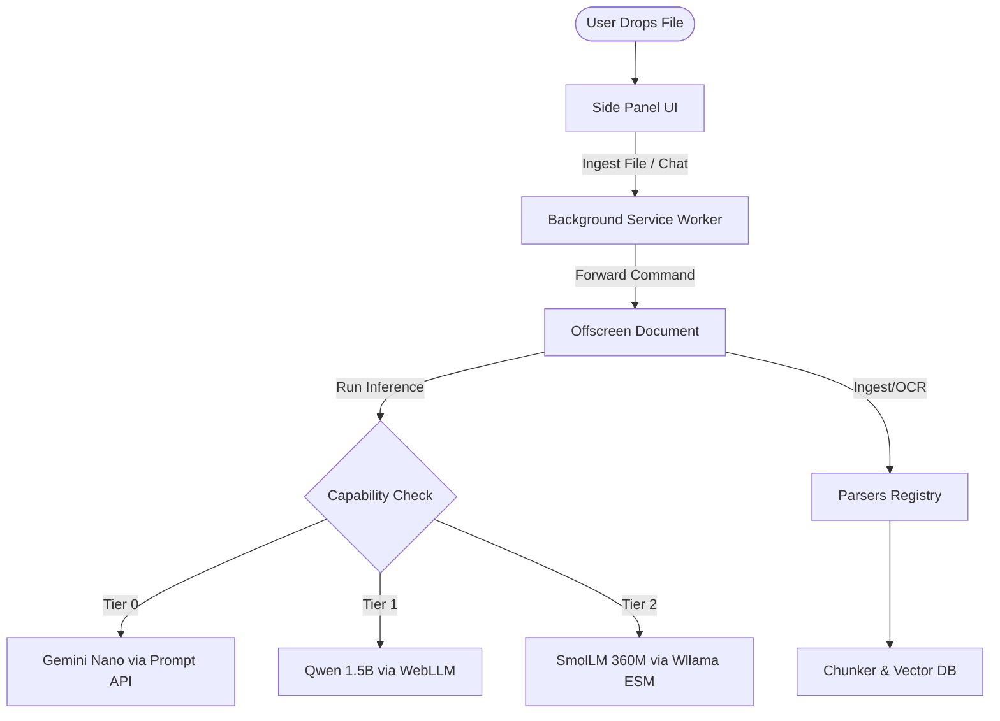

# 🤖 WebLLM Document Reader Chrome Extension

A privacy-focused Chrome Extension that enables **local, offline AI conversations** with your documents. It works entirely within your browser, meaning your files and data never leave your device.


---

## ✨ Features

- 🔒 **100% Private & Local**: Zero remote server calls. All parsing, chunking, vector storage, and AI inference happen locally.
- 📁 **Local Files Only**: Operates strictly on documents you drag-and-drop or select inside the Side Panel UI. No background tracking or content scripts.
- ⚡ **Multi-Tiered AI Architecture**:
  - **Tier 0: Chrome Built-in AI (Gemini Nano)** - Runs directly via Chrome's experimental Prompt API. Zero download needed, ultra-fast.
  - **Tier 1: Local GPU (WebGPU - Qwen 1.5B)** - WebGPU hardware acceleration for fast local responses.
  - **Tier 2: Local CPU (WASM - SmolLM 360M)** - WebAssembly CPU fallback that runs on any standard device.
- 📄 **Extensive Format Support**:
  - **PDF**: Extracts text with page-level citations. Falls back to client-side OCR (Tesseract.js) for scanned documents.
  - **Word (DOCX)**: Parses document paragraphs using Mammoth.
  - **Excel (XLSX, XLS, CSV)**: Parses spreadsheets sheet-by-sheet using XLSX.
  - **PowerPoint (PPTX)**: Custom pure-JS slide text extraction using JSZip.
  - **EPUB**: Custom XML-based ebook sections extraction.
  - **Images (PNG, JPG, JPEG, WEBP)**: Extracts text directly using client-side OCR.
  - **Plain Text / Source Code**: Auto-detects and decodes UTF-8 text files (`.txt`, `.md`, `.json`, `.js`, `.ts`, `.html`, etc.).
- 💬 **Interactive Chat Console**: Beautiful HSL color-themed chat panel with inline citations, message streaming, progress indicator, and citation source drawer.
- 🔋 **Smart Resource Management**: Automatically unloads the model from GPU/CPU memory after 5 minutes of inactivity to prevent resource leaks.

---

## 🏗️ Architecture Overview


```mermaid
graph TD
    User([User Drops File]) --> SP[Side Panel UI]
    SP -- Ingest File / Chat --> BG[Background Service Worker]
    BG -- Forward Command --> OS[Offscreen Document]
    OS -- Run Inference --> HW{Capability Check}
    HW -- Tier 0 --> Gemini[Gemini Nano via Prompt API]
    HW -- Tier 1 --> WebGPU[Qwen 1.5B via WebLLM]
    HW -- Tier 2 --> WASM[SmolLM 360M via Wllama ESM]
    OS -- Ingest/OCR --> Parsers[Parsers Registry]
    Parsers --> Chunker[Chunker & Vector DB]
```

### Component Details
1. **Side Panel (`src/sidepanel/`)**: Handles UI, user inputs, and local settings storage (`preferredEngine`). Initiates connection ports and sends local files as ArrayBuffers to background script.
2. **Background Service Worker (`src/background/background.ts`)**: Manages extension lifecycle, coordinates ports between Side Panel and Offscreen document, and guarantees that the offscreen document is spawned.
3. **Offscreen Document (`src/offscreen/`)**: Operates in a DOM-capable sandbox off the UI thread. Hosts file parsers, indexing pipeline (RAG), vector DB, and the AI models.

---

## 💻 System Requirements

Because the extension supports WASM CPU fallback, it runs on almost any machine, but experience depends on the backend engine:

| Engine | Hardware Requirements | Performance Expectation |
|---|---|---|
| **Chrome Built-in (Gemini Nano)** | Chrome 128+, Gemini Nano model downloaded | Instant streaming, 30-50 tokens/sec. Minimal battery drain. |
| **WebGPU (Qwen 1.5B)** | Compatible GPU (Integrated/Discrete), 8GB+ RAM | 15-30 tokens/sec. Fast, good balance. |
| **WASM (SmolLM 360M)** | Any standard dual-core CPU, 4GB+ RAM | 5-15 tokens/sec. Works on all legacy/low-end systems. |

---

## 🚀 Installation & Setup

### Prerequisites for Chrome Built-in AI (Gemini Nano)
To run Tier 0:
1. Go to `chrome://flags` in Chrome.
2. Search and enable **#optimization-guide-on-device-model** (set to "Enabled BypassPerfRequirement").
3. Search and enable **#prompt-api-for-gemini-nano** (set to "Enabled").
4. Restart Google Chrome.
5. Visit `chrome://components` and check for "Optimization Guide On Device Model". Click "Check for update" to trigger download if version is `0.0.0.0`.

### Build from Source
1. Clone this repository and enter it.
2. Install dependencies:
   ```bash
   npm install
   ```
3. Build the extension:
   ```bash
   npm run build
   ```
   *Note: If you want to bundle it into a zip package for release, run `npm run package`.*

4. Load the unpacked extension:
   - Open Chrome and navigate to `chrome://extensions`.
   - Enable **Developer mode** in the top right corner.
   - Click **Load unpacked** and select the `dist` directory inside the project root.

---

## 🛠 Development Commands

- `npm run dev`: Watches code changes and builds incrementally in development mode.
- `npm run build`: Compiles production build into `/dist`.
- `npm run test`: Executes unit tests for the chunker and RAG pipeline.
- `npm run type-check`: Validates TypeScript typings.
- `npm run lint`: Checks for linting violations.
- `npm run clean`: Cleans up the `/dist` output directory to ensure a fresh compilation.
- `npm run package`: Builds the project and packages it using the release script.

---

## 📦 Packaging & Release Pipeline

The project includes an automated packaging pipeline to prepare the compiled Chrome Extension for distribution (e.g., uploading to the Chrome Web Store).

### Extension Packager Script (`scripts/package-ext.js`)
Instead of relying on OS-specific CLI compression utilities (which can fail across Windows, macOS, or Linux environments), the repository uses a custom Node.js script located at `scripts/package-ext.js`.

#### How the Pipeline Works:
1. **Webpack Compilation**: Triggered by running `npm run package`, Webpack compiles all TypeScript entry points (service worker, sidepanel, offscreen engine) and copies assets to the `/dist` folder.
2. **Directory Scanning**: The packager script dynamically inspects the `/dist` directory to locate all build artifacts.
3. **JSZip Compression**: Utilizing `jszip`, the script compresses all files and directories recursively.
4. **Optimal Compression Level**: The script applies standard `DEFLATE` compression with level 9 (maximum compression) to ensure the extension size is minimized.
5. **Output Archive**: A single production-ready `extension.zip` is created directly in the project root.

To execute the packaging pipeline manually, run:
```bash
npm run package
```
This is shorthand for executing:
```bash
npm run build && node scripts/package-ext.js
```

---

## 📖 Troubleshooting Guide

### Issue: Model loading is stuck or slow on first download
- **Why**: WebGPU and WASM models (Qwen 1.5B is ~900MB; SmolLM 360M is ~240MB) must be downloaded to the browser cache on the first launch of that engine tier.
- **Solution**: Keep the side panel open and wait for the download progress bar to reach 100%. Once downloaded, loading takes under 2 seconds.

### Issue: "WebGPU is not supported" or "No compatible GPU adapter found"
- **Why**: WebGPU may not be enabled or supported by your graphics drivers.
- **Solution**:
  - Visit `chrome://gpu` and check if "WebGPU" is listed as Hardware Accelerated.
  - Enable `#enable-unsafe-webgpu` in `chrome://flags`.
  - If your device does not support WebGPU, choose **WASM (SmolLM 360M)** in the Settings drawer (⚙️) to fallback to CPU-only execution.

### Issue: Memory pressure or Chrome tab crashes
- **Why**: Large documents combined with high context length can trigger Out-of-Memory (OOM) situations on machines with less than 8GB of RAM.
- **Solution**:
  - Close other active tabs/applications before using heavy models.
  - Switch to **WASM (SmolLM 360M)** or **Chrome Built-in AI**, which have a much smaller memory footprint.
  - The extension automatically unloads active models after 5 minutes of inactivity to free system memory.

---

## 🤝 License

This project is licensed under the MIT License.
